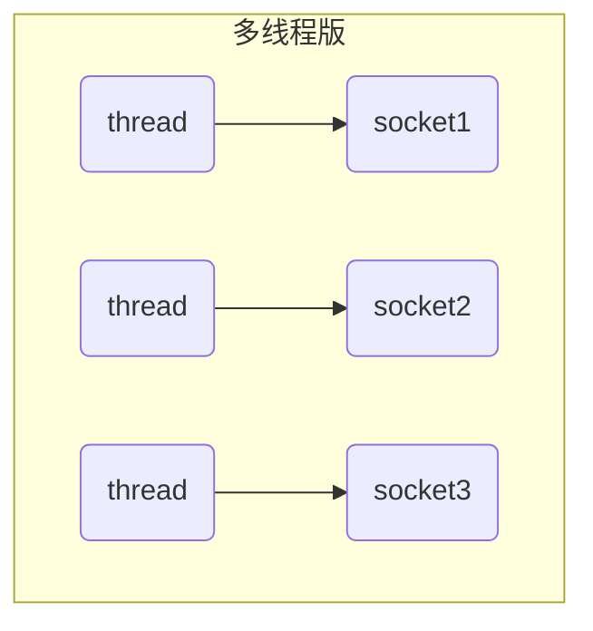
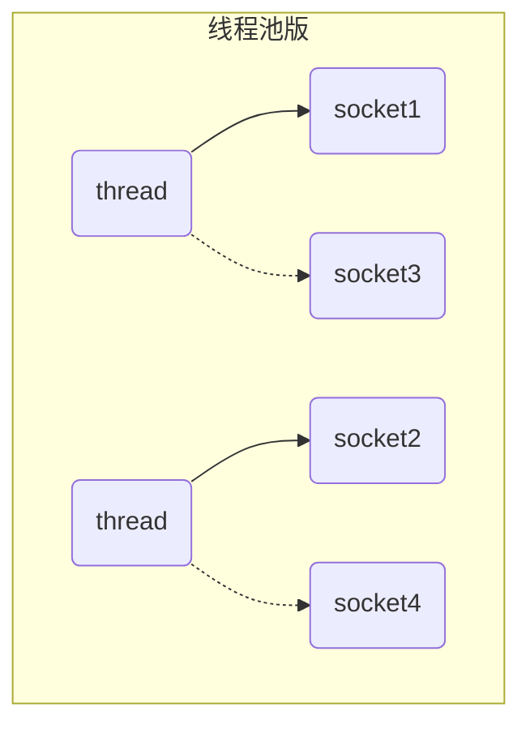
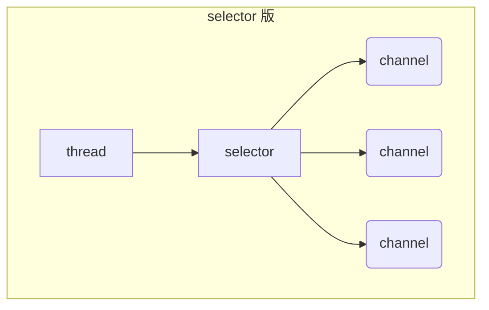
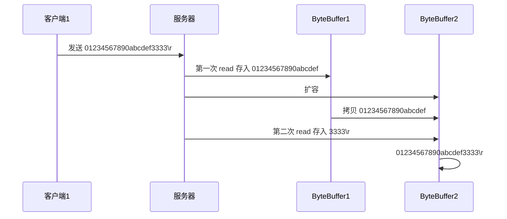

Java NIO可以理解为`Non-Blocking IO`(非阻塞IO)，传统IO的read和write只能阻塞执行，线程在读写IO期间不能干其他事情。例如调用socket.read()方法，若服务器中一直没有数据传输过来，则线程一直处于阻塞模式。

NIO的非阻塞模式是某一个线程从通道发送请求或者读取数据，但是此时并没有可用数据可以读取，线程也不会保持阻塞模式，在数据变的可以读取之前，该线程会去执行其他事件。非阻塞写入也是如此，在向一个通道写入数据，不需要等待完全写入，该线程也可以同时去做别的事情。

## 一、三大组件

NIO的三大核心部分：`Channel(通道)`、`Buffer(缓冲区)`、`Selector(选择器)`

### 1.1、Channel(通道)

channel通道类似于stream流，但又不同。channel是读写数据的双向通道，既可以从通道中读取数据，也可以往通道中写入数据，但流的读写通常是单向的。channel通道可以非阻塞读取和写入通道，支持读取和写入缓冲区，也支持异步地读写。


常见的Channel有：FileChannel、DatagramChannel、SocketChannel、ServerSocketChannel

### 1.2、Buffer(缓冲区)

缓冲区的本质上就是**一块可以写入数据，也可以从中读取数据的内存**。这块内存被包装成`NIO Buffer`对象，并提供了一组方法，方便用来访问该块内存。

常见的buffer有：ByteBuffer、ShortBuffer、IntBuffer、LongBuffer、DoubleBuffer、CharBuffer。

### 1.3、Selector(选择器)

Selector是一个`Java NIO组件`，可以检查一个或多个NIO通道，并确定好哪些通道已经准备好进行读取或写入。结合服务器的设计：

**多线程版设计**

缺点：内存占用高、线程上下文切换成本高、只适合连接数少的场景。



**线程池版设计**

缺点：阻塞模式下，线程只能处理一个socket连接、仅适合短链接场景。



**selector版设计**

`selector`的作用就是配置一个线程去管理多个channel，并监听这些channel，确定哪些channel可以读取或写入数据。这些channel是工作在非阻塞模式下，不会让线程吊死在一个channel上。适合连接数特别多，但流量低的场景。



调用`selector的select()`方法会阻塞直到channel发生了读写就绪事件，这些事件发生，select()方法就会返回这些事件交给thread来处理。

## 二、ByteBuffer

一份txt文件，通过FileChannel读取内容

```txt
1234567890abc
```

```java
try (FileChannel channel = new FileInputStream("nio-demo/data.txt").getChannel()) {
    //准备缓冲区
    ByteBuffer byteBuffer = ByteBuffer.allocate(10);
    do {
        //从channel中读取数据，写到buffer缓冲区中
        int len = channel.read(byteBuffer);
        log.debug("读到的字节数：{}", len);
        if (len == -1) {
            break;
        }
        //切换 buffer 读模式
        byteBuffer.flip();
        //循环输出读取的内容 hasRemaining 是否还有剩余内容为读取
        while(byteBuffer.hasRemaining()) {
            log.debug("{}", (char)byteBuffer.get());
        }
        // 切换 buffer 写模式
        byteBuffer.clear();
    } while (true);
} catch (IOException e) {
    e.printStackTrace();
}
```

### 2.1、ByteBuffer的正确使用姿势

1. 通过`channel.read(buffer)`向buffer写入数据。
2. 调用`buffer.filp()`切换至**读模式**。
3. 从buffer中读取数据，例如调用`buffer.get()`。
4. 调用`buffer.clear()`或`buffer.compact()`切换成**写模式**。
5. 重复以上步骤。

### 2.2、ByteBuffer结构

ByteBuffer的主要属性：

- **mark**：记录当前所标记的索引下标
- **position**：对于写入模式，表示当前可写入数据的下标；对于读取模式，表示接下来可以读取的数据的下标。
- **limit**：对于写入模式，表示当前可以写入的数组大小，默认为数组的最大长度；对于读取模式，表示当前最多可以读取的数据的位置下标。
- **capacity**：表示当前数组的容量大小
- **array**：存储当前写入的数据

**一开始**


**写模式下，position 是写入位置，limit 等于容量，下图表示写入了 4 个字节后的状态**


**flip 动作发生后，position 切换为读取位置，limit 切换为读取限制**


**读取 4 个字节后，状态**


**clear 动作发生后，状态**


**compact 方法，是把未读完的部分向前压缩，然后切换至写模式**


### 2.3、关于ByteBuffer的子类

ByteBuffer的子类有两个：`HeapByteBuffer`和`DirectByteBuffer`。

```java
//创建一个非直接缓冲区
public static ByteBuffer allocate(int capacity) {
    if (capacity < 0)
        throw new IllegalArgumentException();
    return new HeapByteBuffer(capacity, capacity);
}

//创建一个直接缓冲区
public static ByteBuffer allocateDirect(int capacity) {
    return new DirectByteBuffer(capacity);
}
```

- **HeapByteBuffer(堆缓冲)**：内存分配在Java的堆上的，底层是byte[]数组。`适合需要经常释放和分配内存的地方`。
- **DirectByteBuffer(直接缓冲)**：由系统内存直接分配，不被GC直接管理(但Direct Buffer的JAVA对象是归GC管理的，只要GC回收了它的JAVA对象，操作系统才会释放Direct Buffer所申请的空间)。`适合一个ByteBuffer经常被重用的情况下`。

**总结**

1. 创建和释放DirectByteBuffer的代价比HeapByteBuffer的要高，因为在Java堆中分配和释放内存要比系统中要高效的多。
2. 平时的读写操作，都会在I/O设备和应用程序之间经历一个“内核缓冲区”，DirectByteBuffer就像“内核缓冲区”上的缓存，不直接受GC管理。而HeapByteBuffer仅仅是byte[]数组的一种包装形式。因此把一个DirectByteBuffer写入到channel的速度要比把一个HeapByteBuffer写入channel的速度要块。

### 2.4、粘包和半包

粘包和半包在网络通信中是一种常见的现象。**粘包**主要在数据传输时，服务端在一条信息中读取到另外一条信息的数据。**半包**指的是服务端只接收到部分数据，而非完整的数据。主要是由于TCP是面向连接、以“流”的形式传输数据的协议，而`“流”数据是没有明确的开始和结尾边界`。

```java
public static void main(String[] args) {
    /**
     * 网络上有多条数据发送给服务端，数据之间使用 \n 进行分隔
     * 但由于某种原因这些数据在接收时，被进行了重新组合，例如原始数据有3条为
     *
     * Hello,world\n
     * I'm zhangsan\n
     * How are you?\n
     *
     * 变成了下面的两个 byteBuffer (黏包，半包)
     *
     * Hello,world\nI'm zhangsan\nHo
     * w are you?\n
     *
     * 现在要求你编写程序，将错乱的数据恢复成原始的按 \n 分隔的数据
     */
    ByteBuffer buffer = ByteBuffer.allocate(32);
    buffer.put("Hello,world\nI'm zhangsan\nHo".getBytes(StandardCharsets.UTF_8));
    spilt(buffer);
    buffer.put("what are you?\n".getBytes(StandardCharsets.UTF_8));
    spilt(buffer);
}

/**
 * 对粘包的数据进行处理
 *
 * @param buffer
 */
private static void spilt(ByteBuffer buffer) {
    //切换成读模式
    buffer.flip();
    for (int i = 0; i < buffer.limit(); i++) {
        //找到一条完整的数据
        if (buffer.get(i) == '\n') {
            //获取读取数据的长度
            int length = i + 1 - buffer.position();
            ByteBuffer target = ByteBuffer.allocate(length);
            //从buffer中读取，向target中写入
            for (int j = 0; j < length; j++) {
                target.put(buffer.get());
            }
            ByteBufferUtil.debugAll(target);
        }
    }
    buffer.compact();
}
```

```java
//out
+--------+-------------------- all ------------------------+----------------+
position: [12], limit: [12]
         +-------------------------------------------------+
         |  0  1  2  3  4  5  6  7  8  9  a  b  c  d  e  f |
+--------+-------------------------------------------------+----------------+
|00000000| 48 65 6c 6c 6f 2c 77 6f 72 6c 64 0a             |Hello,world.    |
+--------+-------------------------------------------------+----------------+
+--------+-------------------- all ------------------------+----------------+
position: [13], limit: [13]
         +-------------------------------------------------+
         |  0  1  2  3  4  5  6  7  8  9  a  b  c  d  e  f |
+--------+-------------------------------------------------+----------------+
|00000000| 49 27 6d 20 7a 68 61 6e 67 73 61 6e 0a          |I'm zhangsan.   |
+--------+-------------------------------------------------+----------------+
+--------+-------------------- all ------------------------+----------------+
position: [13], limit: [13]
         +-------------------------------------------------+
         |  0  1  2  3  4  5  6  7  8  9  a  b  c  d  e  f |
+--------+-------------------------------------------------+----------------+
|00000000| 48 6f 77 20 61 72 65 20 79 6f 75 3f 0a          |How are you?.   |
+--------+-------------------------------------------------+----------------+
```

## 三、文件编程

### 3.1、FileChannel

> FileChannel**只能工作在非阻塞模式**，与selector不能同时使用。

**获取**

不能直接打开FileChannel，必须通过FileInputStream、FileOutputStream或者RandomAccessFile来获取FileChannel(它们都由getChannel()方法)。

- 通过FileInputStream获取的channel只能读。
- 通过FileOutputStream获取的channel只能写。
- 通过RandomAccessFile是否能读写根据构造RandomAccessFile时的读写模式决定。

**写入**

```java
ByteBuffer buffer = ...;
buffer.put(...); // 存入数据
buffer.flip();   // 切换读模式
//在 while 中调用 channel.write 是因为 write 方法并不能保证一次将 buffer 中的内容全部写入 channel
while(buffer.hasRemaining()) {
    channel.write(buffer);
}
```

**强制写入**

操作系统出于性能的考虑，会将数据缓存，不是立刻写入硬盘。可以调用force(true)方法将文件内容和元数据（文件和权限等信息）立刻写入硬盘。

### 3.2、两个Channel传输数据

```java
public static void main(String[] args) {
    long startTime = System.nanoTime();
    try (
        FileChannel form = new FileInputStream("nio-demo/data.txt").getChannel();
        FileChannel to = new FileOutputStream("nio-demo/to.txt").getChannel();
    ) {
        form.transferTo(0, form.size(), to);
    } catch (IOException e) {
        e.printStackTrace();
    }
    long endTime = System.nanoTime();
    System.out.println("transferTo 用时：" + (endTime - startTime) / 1000_000.0);
}
```

输出

```
transferTo 用时：6.0965
```

### 3.3 Path

jdk7 引入了 Path 和 Paths 类

* Path 用来表示文件路径
* Paths 是工具类，用来获取 Path 实例

```java
Path source = Paths.get("1.txt"); // 相对路径 使用 user.dir 环境变量来定位 1.txt

Path source = Paths.get("d:\\1.txt"); // 绝对路径 代表了  d:\1.txt

Path source = Paths.get("d:/1.txt"); // 绝对路径 同样代表了  d:\1.txt

Path projects = Paths.get("d:\\data", "projects"); // 代表了  d:\data\projects
```

* `.` 代表了当前路径
* `..` 代表了上一级路径

例如目录结构如下

```
d:
	|- data
		|- projects
			|- a
			|- b
```

代码

```java
Path path = Paths.get("d:\\data\\projects\\a\\..\\b");
System.out.println(path);
System.out.println(path.normalize()); // 正常化路径
```

会输出

```
d:\data\projects\a\..\b
d:\data\projects\b
```

### 3.4 Files

检查文件是否存在

```java
Path path = Paths.get("helloword/data.txt");
System.out.println(Files.exists(path));
```

创建一级目录

```java
Path path = Paths.get("helloword/d1");
Files.createDirectory(path);
```

* 如果目录已存在，会抛异常 FileAlreadyExistsException
* 不能一次创建多级目录，否则会抛异常 NoSuchFileException

创建多级目录用

```java
Path path = Paths.get("helloword/d1/d2");
Files.createDirectories(path);
```

拷贝文件

```java
Path source = Paths.get("helloword/data.txt");
Path target = Paths.get("helloword/target.txt");

Files.copy(source, target);
```

* 如果文件已存在，会抛异常 FileAlreadyExistsException

如果希望用 source 覆盖掉 target，需要用 StandardCopyOption 来控制

```java
Files.copy(source, target, StandardCopyOption.REPLACE_EXISTING);
```

移动文件

```java
Path source = Paths.get("helloword/data.txt");
Path target = Paths.get("helloword/data.txt");

Files.move(source, target, StandardCopyOption.ATOMIC_MOVE);
```

* StandardCopyOption.ATOMIC_MOVE 保证文件移动的原子性

删除文件

```java
Path target = Paths.get("helloword/target.txt");

Files.delete(target);
```

* 如果文件不存在，会抛异常 NoSuchFileException

删除目录

```java
Path target = Paths.get("helloword/d1");

Files.delete(target);
```

* 如果目录还有内容，会抛异常 DirectoryNotEmptyException

遍历目录文件

```java
public static void main(String[] args) throws IOException {
    Path path = Paths.get("C:\\Program Files\\Java\\jdk1.8.0_91");
    AtomicInteger dirCount = new AtomicInteger();
    AtomicInteger fileCount = new AtomicInteger();
    Files.walkFileTree(path, new SimpleFileVisitor<Path>(){
        @Override
        public FileVisitResult preVisitDirectory(Path dir, BasicFileAttributes attrs) 
            throws IOException {
            System.out.println(dir);
            dirCount.incrementAndGet();
            return super.preVisitDirectory(dir, attrs);
        }

        @Override
        public FileVisitResult visitFile(Path file, BasicFileAttributes attrs) 
            throws IOException {
            System.out.println(file);
            fileCount.incrementAndGet();
            return super.visitFile(file, attrs);
        }
    });
    System.out.println(dirCount); // 133
    System.out.println(fileCount); // 1479
}
```

统计 jar 的数目

```java
Path path = Paths.get("C:\\Program Files\\Java\\jdk1.8.0_91");
AtomicInteger fileCount = new AtomicInteger();
Files.walkFileTree(path, new SimpleFileVisitor<Path>(){
    @Override
    public FileVisitResult visitFile(Path file, BasicFileAttributes attrs) 
        throws IOException {
        if (file.toFile().getName().endsWith(".jar")) {
            fileCount.incrementAndGet();
        }
        return super.visitFile(file, attrs);
    }
});
System.out.println(fileCount); // 724
```

删除多级目录

```java
Path path = Paths.get("d:\\a");
Files.walkFileTree(path, new SimpleFileVisitor<Path>(){
    @Override
    public FileVisitResult visitFile(Path file, BasicFileAttributes attrs) 
        throws IOException {
        Files.delete(file);
        return super.visitFile(file, attrs);
    }

    @Override
    public FileVisitResult postVisitDirectory(Path dir, IOException exc) 
        throws IOException {
        Files.delete(dir);
        return super.postVisitDirectory(dir, exc);
    }
});
```

#### ⚠️ 删除很危险

> 删除是危险操作，确保要递归删除的文件夹没有重要内容

拷贝多级目录

```java
long start = System.currentTimeMillis();
String source = "D:\\Snipaste-1.16.2-x64";
String target = "D:\\Snipaste-1.16.2-x64aaa";

Files.walk(Paths.get(source)).forEach(path -> {
    try {
        String targetName = path.toString().replace(source, target);
        // 是目录
        if (Files.isDirectory(path)) {
            Files.createDirectory(Paths.get(targetName));
        }
        // 是普通文件
        else if (Files.isRegularFile(path)) {
            Files.copy(path, Paths.get(targetName));
        }
    } catch (IOException e) {
        e.printStackTrace();
    }
});
long end = System.currentTimeMillis();
System.out.println(end - start);
```

## 四、网络编程

### 4.1、非阻塞VS阻塞

#### 阻塞

阻塞是指在发起一个调用之后，在消息返回之前，当前线程/进程会被挂起，直到有消息返回，当前线程/进程才会被激活。

- 网络编程中的阻塞模式下，相关方法都会导致线程暂停。
  - `ServerSocketChannel.accept` 会在没有连接建立时让线程暂停。
  - `SocketChannel.read `会在没有数据可读时让线程暂停。
  - 阻塞的表现就是线程暂停了，暂停期间不会占用CPU，但线程相当于闲置。
- 单线程下，阻塞方法之间相互影响，几乎不能正常工作，需要多线程支持。
- 但在多线程下，有新的问题，体系在以下方面
  - 32 位 jvm 一个线程 320k，64 位 jvm 一个线程 1024k，如果连接数过多，必然导致 OOM，并且线程太多，反而会因为频繁上下文切换导致性能降低
  - 可以采用线程池技术来减少线程数和线程上下文切换，但治标不治本，如果有很多连接建立，但长时间 inactive，会阻塞线程池中所有线程，因此不适合长连接，只适合短连接

**服务器端**

```java
//使用nio来理解阻塞模式，单线程
ByteBuffer buffer = ByteBuffer.allocate(16);
//创建服务器
ServerSocketChannel ssc = ServerSocketChannel.open();
//绑定端口
ssc.bind(new InetSocketAddress(8080));
//连接集合
List<SocketChannel> channels = new ArrayList<>();
while (true) {
    //accept建立与客户端连接，socketchannel用来与客户端之间通信
    log.debug("connecting.....");
    //阻塞方法，线程停止运行
    SocketChannel sc = ssc.accept();
    log.debug("connected....{}", sc);
    channels.add(sc);
    for (SocketChannel channel : channels) {
        //接收客户端发送的数据
        log.debug("before read...{}", channel);
        //阻塞方法，线程停止运行
        channel.read(buffer);
        buffer.flip();  //切换读模式
        ByteBufferUtil.debugRead(buffer);
        buffer.clear();
        log.debug("after read...{}", channel);
    }
}
```

**客户端**

```java
SocketChannel sc = SocketChannel.open();
sc.connect(new InetSocketAddress("localhost", 8080));
Scanner sb = new Scanner(System.in);
String post = sb.nextLine();
while (!post.isEmpty()) {
    sc.write(ByteBuffer.wrap(post.getBytes(StandardCharsets.UTF_8)));
    post = sb.nextLine();
}
```

#### 非阻塞模式

* 非阻塞模式下，相关方法都会不会让线程暂停
  * 在 `ServerSocketChannel.accept` 在没有连接建立时，会返回 null，继续运行
  * `SocketChannel.read` 在没有数据可读时，会返回 0，但线程不必阻塞，可以去执行其它 `SocketChannel `的 read 或是去执行 `ServerSocketChannel.accept `
  * 写数据时，线程只是等待数据写入 Channel 即可，无需等 Channel 通过网络把数据发送出去
* 但非阻塞模式下，即使没有连接建立，和可读数据，线程仍然在不断运行，白白浪费了 cpu
* 数据复制过程中，线程实际还是阻塞的（AIO 改进的地方）

**非阻塞模式的服务端**

```java
// 使用 nio 来理解非阻塞模式, 单线程
// 0. ByteBuffer
ByteBuffer buffer = ByteBuffer.allocate(16);
// 1. 创建了服务器
ServerSocketChannel ssc = ServerSocketChannel.open();
ssc.configureBlocking(false); // 非阻塞模式
// 2. 绑定监听端口
ssc.bind(new InetSocketAddress(8080));
// 3. 连接集合
List<SocketChannel> channels = new ArrayList<>();
while (true) {
    // 4. accept 建立与客户端连接， SocketChannel 用来与客户端之间通信
    SocketChannel sc = ssc.accept(); // 非阻塞，线程还会继续运行，如果没有连接建立，但sc是null
    if (sc != null) {
        log.debug("connected... {}", sc);
        sc.configureBlocking(false); // 非阻塞模式
        channels.add(sc);
    }
    for (SocketChannel channel : channels) {
        // 5. 接收客户端发送的数据
        int read = channel.read(buffer);// 非阻塞，线程仍然会继续运行，如果没有读到数据，read 返回 0
        if (read > 0) {
            buffer.flip();
            debugRead(buffer);
            buffer.clear();
            log.debug("after read...{}", channel);
        }
    }
}
```

#### 多路复用

单线程可以配合 Selector 完成对多个 Channel 可读写事件的监控，这称之为多路复用

* 多路复用仅针对网络 IO、普通文件 IO 没法利用多路复用
* 如果不用 Selector 的非阻塞模式，线程大部分时间都在做无用功，而 Selector 能够保证
  * 有可连接事件时才去连接
  * 有可读事件才去读取
  * 有可写事件才去写入
  * 限于网络传输能力，Channel 未必时时可写，一旦 Channel 可写，会触发 Selector 的可写事件

### 4.2、Selector

一个线程配合 selector 就可以监控多个 channel 的事件，事件发生线程才去处理，避免非阻塞模式下做无用功。让这个线程能够被充分利用。节约了线程的数量。减少了线程上下文切换。

**创建**

```java
Selector selector = Selector.open();
```

**绑定channel事件**

```java
ServerSocketChannel channel = ServerSocketChannel.open();
//非阻塞模式
channel.configureBlocking(false);
//建立selector和channel的关系（注册）
//SelectionKey就是将来事件发生后，通过它可以知道事件和哪个channel的事件
SelectionKey sscKey = channel.register(selector, 0, null);
```

- channel 必须工作在非阻塞模式下
- FileChannel没有非阻塞模式，因此不能配合selector一起使用
- 绑定的事件类型有：
  - connect-客户端连接成功时触发
  - accept-服务端成功接收连接时触发
  - read-数据可读入时触发，有因为接收能力弱，数据暂不能读入的情况
  - write-数据可写出时触发，有因为发送能力弱，数据暂不能写出的情况

**监听Channel事件**

可以通过一下三种方法来监听是否有事件发生，方法的返回值代表有多少channel发生了事件

1. 方法1，阻塞直到绑定事件发生

   ```java
   int count = selector.select();
   ```

2. 方法2：阻塞直到绑定事件发生，或是超时（时间单位为ms）

   ```java
   int count = selector.select(long timeout);
   ```

3. 方法3：不会阻塞，也就是不管有没有事件，立刻返回，自己根据返回值检查是否有事件

   ```java
   int count = selector.selectNow();
   ```

#### 💡 select 何时不阻塞

> * 事件发生时
>   * 客户端发起连接请求，会触发 accept 事件
>   * 客户端发送数据过来，客户端正常、异常关闭时，都会触发 read 事件，另外如果发送的数据大于 buffer 缓冲区，会触发多次读取事件
>   * channel 可写，会触发 write 事件
>   * 在 linux 下 nio bug 发生时
> * 调用 selector.wakeup()
> * 调用 selector.close()
> * selector 所在线程 interrupt

### 4.3、处理 Accept 事件

服务端

```java
//1.创建selector管理多个channel
Selector selector = Selector.open();
//创建缓冲区
ByteBuffer buffer = ByteBuffer.allocate(16);
ServerSocketChannel ssc = ServerSocketChannel.open();
//非阻塞模式
ssc.configureBlocking(false);
//建立selector和channel的关系（注册）
//SelectionKey就是将来事件发生后，通过它可以知道事件和哪个channel的事件
SelectionKey sscKey = ssc.register(selector, SelectionKey.OP_ACCEPT);
log.debug("register key...{}", sscKey);
ssc.bind(new InetSocketAddress(8080));

while (true) {
    //select方法，没有事件发生，线程阻塞，有事件，线程才会恢复运行
    int count = selector.select();
    log.debug("selectCounts...{}", count);
    //处理事件，selectedKeys 内部包含了所有发生的事件
    Iterator<SelectionKey> iterator = selector.selectedKeys().iterator();
    while (iterator.hasNext()) {
        SelectionKey key = iterator.next();
        //判断事件类型
        if (key.isAcceptable()){
            log.debug("key...{}", key);
            ServerSocketChannel channel = (ServerSocketChannel) key.channel();
            //必须处理
            SocketChannel sc = channel.accept();
            log.debug("{}", sc);
        }
        //处理完毕，必须将事件移除
        iterator.remove();
    }
}
```

#### 💡 事件发生后能否不处理

> 事件发生后，要么处理，要么取消（cancel），不能什么都不做，否则下次该事件仍会触发，这是因为 NIO 底层使用的是水平触发。

### 4.4、处理 Read 事件

服务端

```java
try (ServerSocketChannel channel = ServerSocketChannel.open()) {
    //设置非阻塞模式
    channel.configureBlocking(false);
    channel.bind(new InetSocketAddress(8080));
    //创建selector
    Selector selector = Selector.open();
    //channel注册selector
    channel.register(selector, SelectionKey.OP_ACCEPT);

    while (true) {
        int count = selector.select();
        log.debug("select count...{}", count);
        //获取所有事件
        Set<SelectionKey> keys = selector.selectedKeys();
        //遍历所有事件，逐一处理
        Iterator<SelectionKey> iter = keys.iterator();
        while (iter.hasNext()) {
            SelectionKey key = iter.next();
            //判断事件类型
            if (key.isAcceptable()) {
                ServerSocketChannel c = (ServerSocketChannel) key.channel();
                SocketChannel sc = c.accept();
                sc.configureBlocking(false);
                sc.register(selector, SelectionKey.OP_READ);
                log.debug("连接已建立：{}", sc);
            } else if (key.isReadable()) {
                try {
                    SocketChannel sc = (SocketChannel) key.channel();
                    ByteBuffer buffer = ByteBuffer.allocate(128);
                    int read = sc.read(buffer);
                    //客户端正常断开，读取的字节数为-1
                    if (read == -1) {
                        key.channel();
                        sc.close();
                    } else {
                        //切换读模式
                        buffer.flip();
                        //读取数据
                        ByteBufferUtil.debugRead(buffer);
                    }
                } catch (IOException e) {
                    //客户端异常断开
                    e.printStackTrace();
                    key.cancel();
                }
            }
            //处理完毕，必须将事件移除
            iter.remove();
        }
    }

} catch (IOException e) {
    e.printStackTrace();
}
```

#### 💡 为何要 iter.remove()

> 因为 select 在事件发生后，就会将相关的 key 放入 selectedKeys 集合，但不会在处理完后从 selectedKeys 集合中移除，需要我们自己编码删除。例如
>
> * 第一次触发了 ssckey 上的 accept 事件，没有移除 ssckey 
> * 第二次触发了 sckey 上的 read 事件，但这时 selectedKeys 中还有上次的 ssckey ，在处理时因为没有真正的 serverSocket 连上了，就会导致空指针异常

#### 💡 cancel 的作用

> cancel 会取消注册在 selector 上的 channel，并从 keys 集合中删除 key 后续不会再监听事件

#### ⚠️  不处理边界的问题

以前有同学写过这样的代码，思考注释中两个问题，以 bio 为例，其实 nio 道理是一样的

```java
public class Server {
    public static void main(String[] args) throws IOException {
        ServerSocket ss=new ServerSocket(9000);
        while (true) {
            Socket s = ss.accept();
            InputStream in = s.getInputStream();
            // 这里这么写，有没有问题
            byte[] arr = new byte[4];
            while(true) {
                int read = in.read(arr);
                // 这里这么写，有没有问题
                if(read == -1) {
                    break;
                }
                System.out.println(new String(arr, 0, read));
            }
        }
    }
}
```

客户端

```java
public class Client {
    public static void main(String[] args) throws IOException {
        Socket max = new Socket("localhost", 9000);
        OutputStream out = max.getOutputStream();
        out.write("hello".getBytes());
        out.write("world".getBytes());
        out.write("你好".getBytes());
        max.close();
    }
}
```

输出

```
hell
owor
ld�
�好

```

为什么？

#### 处理消息的边界


* 一种思路是固定消息长度，数据包大小一样，服务器按预定长度读取，缺点是浪费带宽
* 另一种思路是按分隔符拆分，缺点是效率低
* TLV 格式，即 Type 类型、Length 长度、Value 数据，类型和长度已知的情况下，就可以方便获取消息大小，分配合适的 buffer，缺点是 buffer 需要提前分配，如果内容过大，则影响 server 吞吐量
  * Http 1.1 是 TLV 格式
  * Http 2.0 是 LTV 格式



服务器端

```java
private static void split(ByteBuffer source) {
    source.flip();
    for (int i = 0; i < source.limit(); i++) {
        // 找到一条完整消息
        if (source.get(i) == '\n') {
            int length = i + 1 - source.position();
            // 把这条完整消息存入新的 ByteBuffer
            ByteBuffer target = ByteBuffer.allocate(length);
            // 从 source 读，向 target 写
            for (int j = 0; j < length; j++) {
                target.put(source.get());
            }
            debugAll(target);
        }
    }
    source.compact(); // 0123456789abcdef  position 16 limit 16
}

public static void main(String[] args) throws IOException {
    // 1. 创建 selector, 管理多个 channel
    Selector selector = Selector.open();
    ServerSocketChannel ssc = ServerSocketChannel.open();
    ssc.configureBlocking(false);
    // 2. 建立 selector 和 channel 的联系（注册）
    // SelectionKey 就是将来事件发生后，通过它可以知道事件和哪个channel的事件
    SelectionKey sscKey = ssc.register(selector, 0, null);
    // key 只关注 accept 事件
    sscKey.interestOps(SelectionKey.OP_ACCEPT);
    log.debug("sscKey:{}", sscKey);
    ssc.bind(new InetSocketAddress(8080));
    while (true) {
        // 3. select 方法, 没有事件发生，线程阻塞，有事件，线程才会恢复运行
        // select 在事件未处理时，它不会阻塞, 事件发生后要么处理，要么取消，不能置之不理
        selector.select();
        // 4. 处理事件, selectedKeys 内部包含了所有发生的事件
        Iterator<SelectionKey> iter = selector.selectedKeys().iterator(); // accept, read
        while (iter.hasNext()) {
            SelectionKey key = iter.next();
            // 处理key 时，要从 selectedKeys 集合中删除，否则下次处理就会有问题
            iter.remove();
            log.debug("key: {}", key);
            // 5. 区分事件类型
            if (key.isAcceptable()) { // 如果是 accept
                ServerSocketChannel channel = (ServerSocketChannel) key.channel();
                SocketChannel sc = channel.accept();
                sc.configureBlocking(false);
                ByteBuffer buffer = ByteBuffer.allocate(16); // attachment
                // 将一个 byteBuffer 作为附件关联到 selectionKey 上
                SelectionKey scKey = sc.register(selector, 0, buffer);
                scKey.interestOps(SelectionKey.OP_READ);
                log.debug("{}", sc);
                log.debug("scKey:{}", scKey);
            } else if (key.isReadable()) { // 如果是 read
                try {
                    SocketChannel channel = (SocketChannel) key.channel(); // 拿到触发事件的channel
                    // 获取 selectionKey 上关联的附件
                    ByteBuffer buffer = (ByteBuffer) key.attachment();
                    int read = channel.read(buffer); // 如果是正常断开，read 的方法的返回值是 -1
                    if(read == -1) {
                        key.cancel();
                    } else {
                        split(buffer);
                        // 需要扩容
                        if (buffer.position() == buffer.limit()) {
                            ByteBuffer newBuffer = ByteBuffer.allocate(buffer.capacity() * 2);
                            buffer.flip();
                            newBuffer.put(buffer); // 0123456789abcdef3333\n
                            key.attach(newBuffer);
                        }
                    }

                } catch (IOException e) {
                    e.printStackTrace();
                    key.cancel();  // 因为客户端断开了,因此需要将 key 取消（从 selector 的 keys 集合中真正删除 key）
                }
            }
        }
    }
}
```

客户端

```java
SocketChannel sc = SocketChannel.open();
sc.connect(new InetSocketAddress("localhost", 8080));
SocketAddress address = sc.getLocalAddress();
// sc.write(Charset.defaultCharset().encode("hello\nworld\n"));
sc.write(Charset.defaultCharset().encode("0123\n456789abcdef"));
sc.write(Charset.defaultCharset().encode("0123456789abcdef3333\n"));
System.in.read();
```


#### ByteBuffer 大小分配

* 每个 channel 都需要记录可能被切分的消息，因为 ByteBuffer 不能被多个 channel 共同使用，因此需要为每个 channel 维护一个独立的 ByteBuffer
* ByteBuffer 不能太大，比如一个 ByteBuffer 1Mb 的话，要支持百万连接就要 1Tb 内存，因此需要设计大小可变的 ByteBuffer
  * 一种思路是首先分配一个较小的 buffer，例如 4k，如果发现数据不够，再分配 8k 的 buffer，将 4k buffer 内容拷贝至 8k buffer，优点是消息连续容易处理，缺点是数据拷贝耗费性能，参考实现 [http://tutorials.jenkov.com/java-performance/resizable-array.html](http://tutorials.jenkov.com/java-performance/resizable-array.html)
  * 另一种思路是用多个数组组成 buffer，一个数组不够，把多出来的内容写入新的数组，与前面的区别是消息存储不连续解析复杂，优点是避免了拷贝引起的性能损耗

### 4.5、处理 Write 事件

#### 一次无法写完例子

* 非阻塞模式下，无法保证把 buffer 中所有数据都写入 channel，因此需要追踪 write 方法的返回值（代表实际写入字节数）
* 用 selector 监听所有 channel 的可写事件，每个 channel 都需要一个 key 来跟踪 buffer，但这样又会导致占用内存过多，就有两阶段策略
  * 当消息处理器第一次写入消息时，才将 channel 注册到 selector 上
  * selector 检查 channel 上的可写事件，如果所有的数据写完了，就取消 channel 的注册
  * 如果不取消，会每次可写均会触发 write 事件

服务端

```java
ServerSocketChannel ssc = ServerSocketChannel.open();
ssc.configureBlocking(false);

Selector selector = Selector.open();
ssc.register(selector, SelectionKey.OP_ACCEPT);

ssc.bind(new InetSocketAddress(8080));

while (true) {
    selector.select();
    Set<SelectionKey> selectionKeys = selector.selectedKeys();
    Iterator<SelectionKey> iter = selectionKeys.iterator();
    while (iter.hasNext()) {
        SelectionKey key = iter.next();
        //事件处理后移除
        iter.remove();
        if (key.isAcceptable()) {
            SocketChannel sc = ssc.accept();
            sc.configureBlocking(false);
            SelectionKey scKey = sc.register(selector, SelectionKey.OP_READ);
            //向客户端发送大量数据
            StringBuilder sb = new StringBuilder();
            for (int i = 0; i < 3000000; i++) {
                sb.append("a");
            }
            ByteBuffer buffer = Charset.defaultCharset().encode(sb.toString());
            //返回值代表实际写入了多少字节
            int write = sc.write(buffer);
            log.debug("向客户端写入字节数...{}", write);
            //如果有剩余未读字节，才需要关注写事件
            if (buffer.hasRemaining()) {
                //在原有关注事件的基础上，多关注写事件
                scKey.interestOps(scKey.interestOps() + SelectionKey.OP_WRITE);
                //把buffer作为附件加入scKey
                scKey.attach(buffer);
            }
        } else if (key.isWritable()) {
            ByteBuffer buffer = (ByteBuffer) key.attachment();
            SocketChannel channel = (SocketChannel) key.channel();
            int write = channel.write(buffer);
            log.debug("再次向客户端写入字节数...{}", write);
            if (!buffer.hasRemaining()) {
                //数据写完了
                key.interestOps(key.interestOps() - SelectionKey.OP_WRITE);
                key.attach(null);
            }
        }
    }
}
```

客户端

```java
Selector selector = Selector.open();
SocketChannel sc = SocketChannel.open();
sc.configureBlocking(false);
sc.register(selector, SelectionKey.OP_CONNECT | SelectionKey.OP_READ);
sc.connect(new InetSocketAddress("localhost", 8080));
int count = 0;
while (true) {
    selector.select();
    Iterator<SelectionKey> iter = selector.selectedKeys().iterator();
    while (iter.hasNext()) {
        SelectionKey key = iter.next();
        iter.remove();
        if (key.isConnectable()) {
            System.out.println(sc.finishConnect());
        } else if (key.isReadable()) {
            ByteBuffer buffer = ByteBuffer.allocate(1024 * 1024);
            count += sc.read(buffer);
            buffer.clear();
            System.out.println(count);
        }
    }
}
```

#### 💡 write 为何要取消

只要向 channel 发送数据时，socket 缓冲可写，这个事件会频繁触发，因此应当只在 socket 缓冲区写不下时再关注可写事件，数据写完之后再取消关注。

### 4.6、利用多线程优化

多核CPU，设计时要充分考虑别人CPU的性能被白白浪费。

分两组选择器：

1. 单线程配一个选择器，专门处理 accept 事件。
2. 创建CPU核心数的线程，每个线程配一个选择器，轮流处理 read 事件。

```java
public static void main(String[] args) throws IOException {
    new BossEventLoop().register();
}

/**
     * 单线程配一个选择器，专门处理accept连接事件
     */
@Slf4j
static class BossEventLoop implements Runnable {
    private Selector boss;
    /**
         * 专门处理读写的工作线程
         */
    private WorkerEventLoop[] workers;
    private volatile boolean start = false;
    AtomicInteger index = new AtomicInteger();

    public void register() throws IOException {
        if (!start) {
            ServerSocketChannel ssc = ServerSocketChannel.open();
            //绑定端口
            ssc.bind(new InetSocketAddress(8080));
            //设置非阻塞模式
            ssc.configureBlocking(false);
            boss = Selector.open();
            SelectionKey sscKey = ssc.register(boss, SelectionKey.OP_ACCEPT, null);
            //创建多个workers
            workers = initEventLoops();
            new Thread(this, "boss").start();
            log.debug("boss start...");
            start = true;
        }
    }

    /**
         * 初始化工作线程
         * @return
         */
    public WorkerEventLoop[] initEventLoops() {
        //        EventLoop[] eventLoops = new EventLoop[Runtime.getRuntime().availableProcessors()];
        WorkerEventLoop[] workerEventLoops = new WorkerEventLoop[2];
        for (int i = 0; i < workerEventLoops.length; i++) {
            workerEventLoops[i] = new WorkerEventLoop(i);
        }
        return workerEventLoops;
    }

    /**
         * 处理客户端连接事件
         */
    @Override
    public void run() {
        while (true) {
            try {
                boss.select();
                Set<SelectionKey> selectionKeys = boss.selectedKeys();
                Iterator<SelectionKey> iter = selectionKeys.iterator();
                while (iter.hasNext()) {
                    SelectionKey key = iter.next();
                    iter.remove();
                    if (key.isAcceptable()) {
                        ServerSocketChannel ssc = (ServerSocketChannel) key.channel();
                        SocketChannel sc = ssc.accept();
                        sc.configureBlocking(false);
                        log.debug("{} connected", sc.getRemoteAddress());
                        workers[index.getAndIncrement() % workers.length].register(sc);
                    }
                }
            } catch (IOException e) {
                e.printStackTrace();
            }
        }
    }
}

/**
     * 工作线程workers
     */
@Slf4j
static class WorkerEventLoop implements Runnable {
    private Selector selector;
    private volatile boolean start = false;
    private int index;

    /**
         * 消息队列，线程之间通信
         */
    private final ConcurrentLinkedQueue<Runnable> tasks = new ConcurrentLinkedQueue<>();

    public WorkerEventLoop(int index) {
        this.index = index;
    }

    public void register(SocketChannel sc) throws IOException {
        if (!start) {
            selector = Selector.open();
            new Thread(this, "worker-" + index).start();
            start = true;
        }
        //将注册读事件的操作添加进消息队列中
        tasks.add(() -> {
            try {
                SelectionKey selectionKey = sc.register(selector, SelectionKey.OP_READ);
                selector.selectNow();
            } catch (IOException e) {
                e.printStackTrace();
            }
        });
        //唤醒selector线程
        selector.wakeup();
    }

    @Override
    public void run() {
        while (true) {
            try {
                selector.select();
                //取出消息队列中的任务
                Runnable task = tasks.poll();
                if (task != null) {
                    task.run();
                }
                Set<SelectionKey> keys = selector.selectedKeys();
                Iterator<SelectionKey> iter = keys.iterator();
                while (iter.hasNext()) {
                    SelectionKey key = iter.next();
                    if (key.isReadable()) {
                        SocketChannel sc = (SocketChannel) key.channel();
                        ByteBuffer buffer = ByteBuffer.allocate(16);
                        try {
                            int read = sc.read(buffer);
                            if (read == -1) {
                                key.cancel();
                                sc.close();
                            } else {
                                buffer.flip();
                                log.debug("{} message:", sc.getRemoteAddress());
                                //ByteBufferUtil.debugAll(buffer);
                                System.out.println(Charset.defaultCharset().decode(buffer));
                            }
                        } catch (IOException e) {
                            e.printStackTrace();
                            key.cancel();
                            sc.close();
                        }
                    }
                    iter.remove();
                }
            } catch (IOException e) {
                e.printStackTrace();
            }
        }
    }
}
```

## 5. NIO vs BIO

### 5.1 stream vs channel

* `stream `不会自动缓冲数据，`channel `会利用系统提供的发送缓冲区、接收缓冲区（更为底层）
* stream 仅支持阻塞 API，channel 同时支持阻塞、非阻塞 API，网络 channel 可配合 selector 实现多路复用
* 二者均为全双工，即读写可以同时进行

### 5.2 IO 模型

同步阻塞、同步非阻塞、同步多路复用、异步阻塞（没有此情况）、异步非阻塞

* 同步：线程自己去获取结果（一个线程）
* 异步：线程自己不去获取结果，而是由其它线程送结果（至少两个线程）

当调用一次 channel.read 或 stream.read 后，会切换至操作系统内核态来完成真正数据读取，而读取又分为两个阶段，分别为：

* 等待数据阶段
* 复制数据阶段


* 阻塞 IO

  

* 非阻塞  IO

  

* 多路复用

  

* 信号驱动

* 异步 IO

  

* 阻塞 IO vs 多路复用

  

  

#### 🔖 参考

UNIX 网络编程 - 卷 I

### 5.3 零拷贝

#### 传统 IO 问题

传统的 IO 将一个文件通过 socket 写出

```java
File f = new File("helloword/data.txt");
RandomAccessFile file = new RandomAccessFile(file, "r");

byte[] buf = new byte[(int)f.length()];
file.read(buf);

Socket socket = ...;
socket.getOutputStream().write(buf);
```

内部工作流程是这样的：


1. java 本身并不具备 IO 读写能力，因此 read 方法调用后，要从 java 程序的**用户态**切换至**内核态**，去调用操作系统（Kernel）的读能力，将数据读入**内核缓冲区**。这期间用户线程阻塞，操作系统使用 DMA（Direct Memory Access）来实现文件读，其间也不会使用 cpu

   > DMA 也可以理解为硬件单元，用来解放 cpu 完成文件 IO

2. 从**内核态**切换回**用户态**，将数据从**内核缓冲区**读入**用户缓冲区**（即 byte[] buf），这期间 cpu 会参与拷贝，无法利用 DMA

3. 调用 write 方法，这时将数据从**用户缓冲区**（byte[] buf）写入 **socket 缓冲区**，cpu 会参与拷贝

4. 接下来要向网卡写数据，这项能力 java 又不具备，因此又得从**用户态**切换至**内核态**，调用操作系统的写能力，使用 DMA 将 **socket 缓冲区**的数据写入网卡，不会使用 cpu

可以看到中间环节较多，java 的 IO 实际不是物理设备级别的读写，而是缓存的复制，底层的真正读写是操作系统来完成的

* 用户态与内核态的切换发生了 3 次，这个操作比较重量级
* 数据拷贝了共 4 次

#### NIO 优化

通过 DirectByteBuf 

* ByteBuffer.allocate(10)  HeapByteBuffer 使用的还是 java 内存
* ByteBuffer.allocateDirect(10)  DirectByteBuffer 使用的是操作系统内存


大部分步骤与优化前相同，不再赘述。唯有一点：java 可以使用 DirectByteBuf 将堆外内存映射到 jvm 内存中来直接访问使用

* 这块内存不受 jvm 垃圾回收的影响，因此内存地址固定，有助于 IO 读写
* java 中的 DirectByteBuf 对象仅维护了此内存的虚引用，内存回收分成两步
  * DirectByteBuf 对象被垃圾回收，将虚引用加入引用队列
  * 通过专门线程访问引用队列，根据虚引用释放堆外内存
* 减少了一次数据拷贝，用户态与内核态的切换次数没有减少


进一步优化（底层采用了 linux 2.1 后提供的 sendFile 方法），java 中对应着两个 channel 调用 transferTo/transferFrom 方法拷贝数据


1. java 调用 transferTo 方法后，要从 java 程序的**用户态**切换至**内核态**，使用 DMA将数据读入**内核缓冲区**，不会使用 cpu
2. 数据从**内核缓冲区**传输到 **socket 缓冲区**，cpu 会参与拷贝
3. 最后使用 DMA 将 **socket 缓冲区**的数据写入网卡，不会使用 cpu

可以看到

* 只发生了一次用户态与内核态的切换
* 数据拷贝了 3 次

进一步优化（linux 2.4）


1. java 调用 transferTo 方法后，要从 java 程序的**用户态**切换至**内核态**，使用 DMA将数据读入**内核缓冲区**，不会使用 cpu
2. 只会将一些 offset 和 length 信息拷入 **socket 缓冲区**，几乎无消耗
3. 使用 DMA 将 **内核缓冲区**的数据写入网卡，不会使用 cpu

整个过程仅只发生了一次用户态与内核态的切换，数据拷贝了 2 次。所谓的【零拷贝】，并不是真正无拷贝，而是在不会拷贝重复数据到 jvm 内存中，零拷贝的优点有

* 更少的用户态与内核态的切换
* 不利用 cpu 计算，减少 cpu 缓存伪共享
* 零拷贝适合小文件传输

### 5.3 AIO

AIO 用来解决数据复制阶段的阻塞问题

* 同步意味着，在进行读写操作时，线程需要等待结果，还是相当于闲置
* 异步意味着，在进行读写操作时，线程不必等待结果，而是将来由操作系统来通过回调方式由另外的线程来获得结果

> 异步模型需要底层操作系统（Kernel）提供支持
>
> * Windows 系统通过 IOCP 实现了真正的异步 IO
> * Linux 系统异步 IO 在 2.6 版本引入，但其底层实现还是用多路复用模拟了异步 IO，性能没有优势

#### 文件 AIO

先来看看 AsynchronousFileChannel

```java
@Slf4j
public class AioDemo1 {
    public static void main(String[] args) throws IOException {
        try{
            AsynchronousFileChannel s = 
                AsynchronousFileChannel.open(
                	Paths.get("1.txt"), StandardOpenOption.READ);
            ByteBuffer buffer = ByteBuffer.allocate(2);
            log.debug("begin...");
            s.read(buffer, 0, null, new CompletionHandler<Integer, ByteBuffer>() {
                @Override
                public void completed(Integer result, ByteBuffer attachment) {
                    log.debug("read completed...{}", result);
                    buffer.flip();
                    debug(buffer);
                }

                @Override
                public void failed(Throwable exc, ByteBuffer attachment) {
                    log.debug("read failed...");
                }
            });

        } catch (IOException e) {
            e.printStackTrace();
        }
        log.debug("do other things...");
        System.in.read();
    }
}
```

输出

```
13:44:56 [DEBUG] [main] c.i.aio.AioDemo1 - begin...
13:44:56 [DEBUG] [main] c.i.aio.AioDemo1 - do other things...
13:44:56 [DEBUG] [Thread-5] c.i.aio.AioDemo1 - read completed...2
         +-------------------------------------------------+
         |  0  1  2  3  4  5  6  7  8  9  a  b  c  d  e  f |
+--------+-------------------------------------------------+----------------+
|00000000| 61 0d                                           |a.              |
+--------+-------------------------------------------------+----------------+
```

可以看到

* 响应文件读取成功的是另一个线程 Thread-5
* 主线程并没有 IO 操作阻塞

#### 💡 守护线程

默认文件 AIO 使用的线程都是守护线程，所以最后要执行 `System.in.read()` 以避免守护线程意外结束

#### 网络 AIO

```java
public class AioServer {
    public static void main(String[] args) throws IOException {
        AsynchronousServerSocketChannel ssc = AsynchronousServerSocketChannel.open();
        ssc.bind(new InetSocketAddress(8080));
        ssc.accept(null, new AcceptHandler(ssc));
        System.in.read();
    }

    private static void closeChannel(AsynchronousSocketChannel sc) {
        try {
            System.out.printf("[%s] %s close\n", Thread.currentThread().getName(), sc.getRemoteAddress());
            sc.close();
        } catch (IOException e) {
            e.printStackTrace();
        }
    }

    private static class ReadHandler implements CompletionHandler<Integer, ByteBuffer> {
        private final AsynchronousSocketChannel sc;

        public ReadHandler(AsynchronousSocketChannel sc) {
            this.sc = sc;
        }

        @Override
        public void completed(Integer result, ByteBuffer attachment) {
            try {
                if (result == -1) {
                    closeChannel(sc);
                    return;
                }
                System.out.printf("[%s] %s read\n", Thread.currentThread().getName(), sc.getRemoteAddress());
                attachment.flip();
                System.out.println(Charset.defaultCharset().decode(attachment));
                attachment.clear();
                // 处理完第一个 read 时，需要再次调用 read 方法来处理下一个 read 事件
                sc.read(attachment, attachment, this);
            } catch (IOException e) {
                e.printStackTrace();
            }
        }

        @Override
        public void failed(Throwable exc, ByteBuffer attachment) {
            closeChannel(sc);
            exc.printStackTrace();
        }
    }

    private static class WriteHandler implements CompletionHandler<Integer, ByteBuffer> {
        private final AsynchronousSocketChannel sc;

        private WriteHandler(AsynchronousSocketChannel sc) {
            this.sc = sc;
        }

        @Override
        public void completed(Integer result, ByteBuffer attachment) {
            // 如果作为附件的 buffer 还有内容，需要再次 write 写出剩余内容
            if (attachment.hasRemaining()) {
                sc.write(attachment);
            }
        }

        @Override
        public void failed(Throwable exc, ByteBuffer attachment) {
            exc.printStackTrace();
            closeChannel(sc);
        }
    }

    private static class AcceptHandler implements CompletionHandler<AsynchronousSocketChannel, Object> {
        private final AsynchronousServerSocketChannel ssc;

        public AcceptHandler(AsynchronousServerSocketChannel ssc) {
            this.ssc = ssc;
        }

        @Override
        public void completed(AsynchronousSocketChannel sc, Object attachment) {
            try {
                System.out.printf("[%s] %s connected\n", Thread.currentThread().getName(), sc.getRemoteAddress());
            } catch (IOException e) {
                e.printStackTrace();
            }
            ByteBuffer buffer = ByteBuffer.allocate(16);
            // 读事件由 ReadHandler 处理
            sc.read(buffer, buffer, new ReadHandler(sc));
            // 写事件由 WriteHandler 处理
            sc.write(Charset.defaultCharset().encode("server hello!"), ByteBuffer.allocate(16), new WriteHandler(sc));
            // 处理完第一个 accpet 时，需要再次调用 accept 方法来处理下一个 accept 事件
            ssc.accept(null, this);
        }

        @Override
        public void failed(Throwable exc, Object attachment) {
            exc.printStackTrace();
        }
    }
}
```

